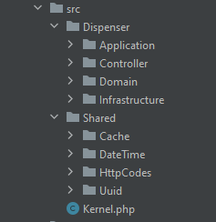
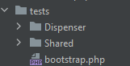
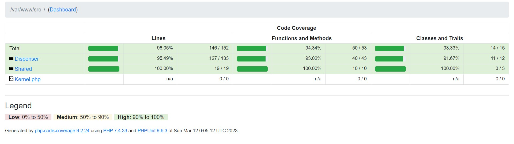
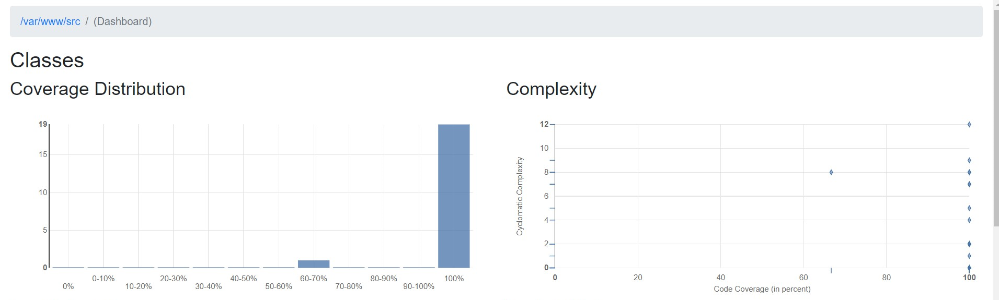

# Beer-tap-dispenser-API
Beer tap dispenser API Taxonomy.
under `webServer/App/src` live the code, this is separated by "modules", in turn each module is separated by "abstraction layers"

    Controller: represent the entry point. given a request provide a response
    Application: It is in charge to represent in transactional way the use cases
    Domain: Contain the business rules to this "module"
    Infrastructure: are the concrete implementations for specifics 3erd party software or modified nature responses from the domain
    under Shared lives the necesary code to use by all the modules
# Getting Started
* Clone project

        git clone https://github.com/david-espinosa-fari/Beer-tap-dispenser-API.git
        cd Beer-tap-dispenser-API/
  * After previews command you have several options
    * If you want to use and install your own web server the app lives under folder `webServer/App`, and point your server to /var/www/public in your configuration. All request must pass through index.php
    This file is an example of virtual host `webServer/config/apache/vhosts/pvportal.conf`. Under webServer/App do `composer install` to install 3rd party software dependencies. [composer](https://getcomposer.org/download/)

    * I recommend the following
      1.	Install [docker](https://docs.docker.com/install/) and [docker-compose](https://docs.docker.com/compose/install/)
      2. on your console under `Beer-tap-dispenser-API/` folder do

               cp .env.dist .env
               docker-compose up -d --build
      3. When the process are finish you can do some cool stuff request
         1. curl --location 'http://localhost/dispenser' \
            --header 'Content-Type: application/json' \
            --data '{
            "flow_volume": 0.0653
            }'
         2. I think, is too much work generate a OpenApi doc for the scope of this task, you can use the full [postman](https://www.postman.com/downloads/) collection that lives under `webServer/App/doc`, there you will find the collection and the environment to use.
### Related to tests
Test lives under `webServer/App/tests` and renders the folder hierarchy from src/

#### Coverage Statistic

You can find the entire statistics under webServer/App/public/cover/ folder, open `webServer/App/public/cover/index.html` with your favor explorer(Mozilla, Chrome).
#### Running tests
The test are separated by nature, related to Integration or unitary to favor "pipelines"
    
* Running all tests
  
      docker exec -i app php vendor/bin/phpunit --testdox
* Running unit test

      docker exec -i app php vendor/bin/phpunit --group UnitTest --testdox
* Running integration test

      docker exec -i app php vendor/bin/phpunit --group Integration --testdox

#### Next steps
* Document the Api with Openapi
* Publish docker container
* Develop pipelines to CI and CD
* Deploy anywhere
